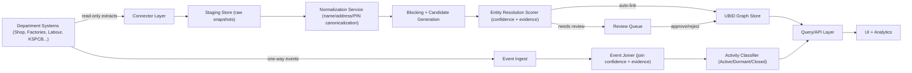
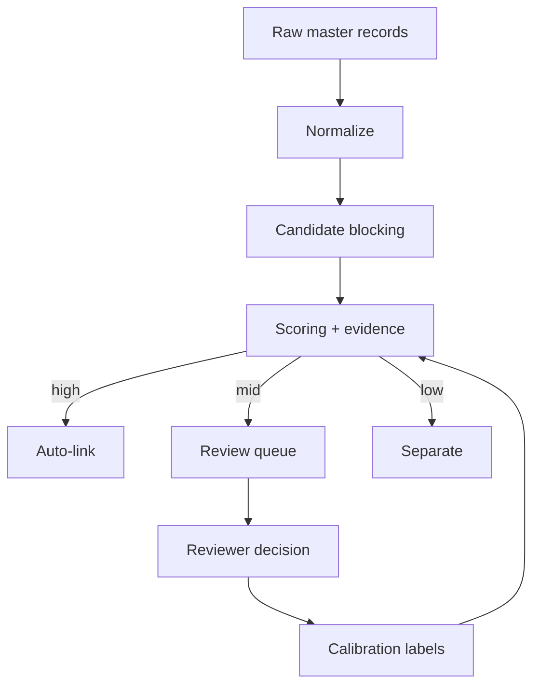

# Karnataka Business Identity Graph (UBID + Active Business Intelligence)

An interactive prototype for **AI for Bharat (Theme 1)**: creating a **Unique Business Identifier (UBID)** across Karnataka State department systems, and inferring **Active / Dormant / Closed** status from one-way activity streams with **explainable, reversible decisions**.

Live demo: https://d4rv5gb2fnpti.cloudfront.net/

Video walkthrough: https://drive.google.com/file/d/1iBWmrVidyWHheQPNu9COe0w8JzIrCaA1/view?usp=sharing

This repository contains:

- A working UI prototype (runs fully on deterministic synthetic data).
- A production-grade technical design:
  - `docs/ARCHITECTURE.md`
  - `docs/ML_WORKFLOW.md`
  - `docs/DATA_MODEL.md`
  - `docs/DEPLOYMENT.md`

## Why This Matters

Karnataka's business data lives across 40+ departmental systems built in isolation. Names/addresses are free-text, IDs are system-specific, and PAN/GSTIN are inconsistently captured. Without a reliable join key:

- The same business appears as multiple records across systems.
- Activity signals (inspections, renewals, filings, consumption) cannot be aggregated per business.
- Commerce & Industry cannot answer operational questions like: "active factories in PIN 560058 with no inspection in 18 months".

The platform here adds a **UBID layer beside existing systems** (no migration, no schema changes), and provides a safe pathway to link records and reason about active operations.

## Prototype Capabilities (Implemented)

- **Universal lookup**: by department record ID, PAN, GSTIN, name, address, or PIN.
- **Entity resolution**: confidence-scored linking, with explicit **auto-link / review / separate** thresholds.
- **Explainability**: every linkage shows evidence factors (identifier, name similarity, address locality, PIN).
- **Human-in-the-loop review**: ambiguous matches become review tasks; decisions are reversible.
- **Activity intelligence**: one-way events join to UBIDs; each UBID is classified as **Active/Dormant/Closed** with an evidence timeline.
- **Exceptions surfaced**: low-confidence event joins show up in an unmatched queue, not silently dropped.
- **Audit ledger**: merge/split/classification/review actions captured for traceability.
- **Policy query lab**: demonstrates cross-system queries that were impossible previously.

## Non-Negotiables

- **No source system changes**: modeled as read-only connectors and one-way event ingestion.
- **Synthetic/scrambled data safe**: prototype runs on deterministic synthetic data; no dependency on real business PII.
- **Explainable + reversible**: link decisions and activity classifications are evidence-based, thresholded, and reversible via review.
- **No hosted LLM on raw PII**: design assumes matching works on normalized tokens, hashes, and scrambled fixtures.

## Run Locally

Prerequisites: Node.js 20+.

```bash
npm ci
npm run dev
```

Open:

```text
http://127.0.0.1:5173/
```

Build and lint:

```bash
npm run lint
npm run build
```

## Project Structure

```text
src/
  App.tsx        UI + deterministic synthetic dataset + workflows
  App.css        UI styling
  index.css      base styles
  main.tsx       React entry
.github/
  workflows/ci.yml  GitHub Actions (lint + build)
backup-ui-*      local backups (gitignored)
```

## Docs Index

- `docs/ARCHITECTURE.md` - system architecture and design decisions
- `docs/ML_WORKFLOW.md` - entity resolution + activity inference workflow
- `docs/DATA_MODEL.md` - reference data model + evidence storage
- `docs/DEPLOYMENT.md` - scalability, deployment, and security posture

## Architecture & Technical Design (Production Path)

The prototype is a UI-only sandbox. The design below describes the production platform that can run beside existing systems.

### System Architecture Diagram



### AI/ML Workflow (Entity Resolution + Activity)

**Entity resolution** is best treated as a calibrated scoring system with human labels:

1. Normalize name/address/PIN; compute stable hashes for PAN/GSTIN (when present).
2. Generate candidates using blocking keys (PIN + locality tokens + identifier presence).
3. Score candidate pairs with a hybrid model:
   - Deterministic rules (PAN/GSTIN exact match => strong anchor).
   - Learned weights (string similarity, address token overlap, locality match, department-specific priors).
4. Calibrate score into a probability-like confidence.
5. Route by thresholds:
   - `>= auto_link_threshold`: auto-link (still reversible).
   - `review_threshold .. auto_link_threshold`: queue for reviewer.
   - `< review_threshold`: keep separate.
6. Store reviewer decisions as labeled examples to improve calibration over time.

**Activity inference** uses explainable scoring across a time window:

- Strong active signals: recent renewals/filings, sustained consumption.
- Dormant signals: long inactivity windows.
- Closed signals: closure consents, explicit shutdown events, and near-zero consumption over time.



### Database / API Flow (Reference Design)

Suggested storage choices:

- **PostgreSQL** for snapshots, review tasks, audit ledger, and queryable materializations.
- **Graph store** abstraction for UBID relationships (can be Postgres adjacency tables initially).
- **Object storage** for raw snapshots if volumes grow.

Core entities:

- `source_record(department, source_id, normalized_fields, identifier_hashes, snapshot_ts)`
- `ubid(ubid_id, anchor_type, anchor_hash, created_ts)`
- `ubid_edge(ubid_id, source_record_pk, confidence, evidence_json, status)`
- `review_task(task_id, left_ref, right_ref, score, evidence_json, state, reviewer_action)`
- `event(event_id, source, raw_ref, normalized_payload, event_ts)`
- `event_join(event_id, ubid_id, join_confidence, evidence_json, state)`
- `activity_status(ubid_id, status, confidence, window_start, window_end, evidence_json)`
- `audit_log(audit_id, actor, action, target_ref, reversible, details_json, ts)`

API shape (illustrative):

- `GET /v1/lookup?...` -> UBID + evidence
- `GET /v1/ubids/{id}` -> dossier + linked records
- `GET /v1/ubids/{id}/activity` -> verdict + timeline + evidence
- `POST /v1/reviews/{task}/decision` -> approve/reject + optional notes
- `GET /v1/queries/...` -> policy query results + explanation

### Scalability & Deployment

- **Scale reads, not writes**: department systems are unchanged; connectors only read.
- **Incremental resolution**: resolve only changed/new records per snapshot, not full recompute.
- **Partitioning**: partition by district/PIN prefix and department for staging tables.
- **Asynchronous pipelines**: connectors -> normalization -> candidate gen -> scoring -> review.
- **Human review load control**: tighten thresholds to minimize merges; prioritize false-merge avoidance.
- **Deployment**: containerized services (K8s), separate worker pools for scoring and ingestion, Postgres HA.
- **Security**: keep scrambled fixtures and hashed identifiers; full PII remains in source systems.

