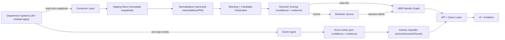

# Architecture & Technical Design

This document expands the production path described in the repository `README.md`.

## Key Constraints

- No changes to source department systems.
- Deterministically scrambled or synthetic data in sandbox.
- Every automated decision must be explainable and reversible.
- Hosted LLM calls on raw PII are not permitted.

## Reference Architecture

## Explainability + Reversibility

- Store evidence at the edge: `ubid_edge.evidence_json` explains why a source record attaches to a UBID.
- Treat merges as graph operations, not destructive overwrites.
- Reviewer decisions create an audit entry and can be reversed by policy.

## Incremental Operation

- Resolve only new/changed records per snapshot.
- Partition work by PIN prefix / district to parallelize.
- Maintain a "dirty set" of UBIDs affected by new edges for reclassification.
